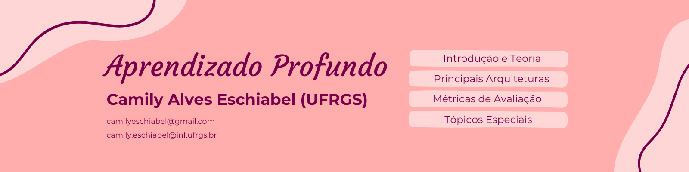

<p align="center">
  
</p>

# CMP627 — Aprendizado Profundo

Repositório com resumos, implementações e experimentos desenvolvidos ao longo da disciplina **CMP627 — Aprendizado Profundo**, do Programa de Pós-Graduação em Computação da **Universidade Federal do Rio Grande do Sul (UFRGS)**.

O objetivo deste projeto é reunir, de forma organizada, os principais conceitos estudados durante a disciplina, combinando resumos teóricos, implementações em Python e experimentos realizados ao longo do semestre. A proposta é servir tanto como material de revisão quanto como documentação do meu processo de aprendizagem em Deep Learning.

> Este repositório possui caráter exclusivamente educacional e foi desenvolvido como material complementar de estudo.

<p align="center">
  
</p>

## Organização do repositório

O conteúdo está organizado em módulos temáticos, acompanhando a evolução dos conceitos apresentados na disciplina.

```text
01. Fundamentos
02. Treinamento
03. Arquiteturas
04. Modelos Generativos
05. Modelos Multimodais
06. Tópicos Especiais
```

Cada módulo possui seu próprio **README**, contendo:

- Resumo dos principais conceitos;
- Implementações em Python;
- Resultados experimentais;
- Referências para aprofundamento.

<p align="center">
  
</p>

## Estrutura

```text
deep-learning-ufrgs/
│
├── 01-fundamentos/
├── 02-treinamento/
├── 03-arquiteturas/
├── 04-modelos-generativos/
├── 05-modelos-multimodais/
├── 06-topicos-especiais/
│
├── assets/
│   ├── capa.png
│   └── divisoria.png
│
└── README.md
```

<p align="center">
  
</p>

## Tecnologias utilizadas

- Python
- NumPy
- PyTorch
- TensorFlow
- Keras
- Matplotlib
- Jupyter Notebook

<p align="center">
  
</p>

## Conteúdo

| Módulo | Principais tópicos |
|---------|--------------------|
| **Fundamentos** | Perceptron, MLP, funções de ativação, funções de custo, backpropagation |
| **Treinamento** | Regressão, classificação, holdout, regularização, dropout |
| **Arquiteturas** | CNNs, RNNs, LSTMs, Transformers, GNNs |
| **Modelos Generativos** | Autoencoders, GANs, Diffusion Models |
| **Modelos Multimodais** | CLIP |
| **Tópicos Especiais** | Transfer Learning, Fine-tuning, LoRA, Ética em IA |

<p align="center">
  
</p>

## Créditos

Grande parte do conteúdo deste repositório foi desenvolvida a partir das aulas da disciplina **CMP627 — Aprendizado Profundo**, ministrada pelo **Prof. Anderson Rocha Tavares** (UFRGS).

Os slides e demais materiais didáticos utilizados na disciplina pertencem aos seus respectivos autores e são disponibilizados para fins educacionais, conforme a licença definida em seu repositório oficial.

Este projeto reúne exclusivamente minhas anotações, implementações e experimentos, não substituindo o material original da disciplina. Eventuais erros, omissões ou interpretações incorretas são de minha inteira responsabilidade.

<p align="center">
  
</p>

## Referências

- Página da disciplina: https://www.inf.ufrgs.br/ppgc/disciplinas/lista-de-disciplinas/CMP627
- Repositório oficial dos slides: https://andertavares.github.io/deeplearning-ufrgs/
